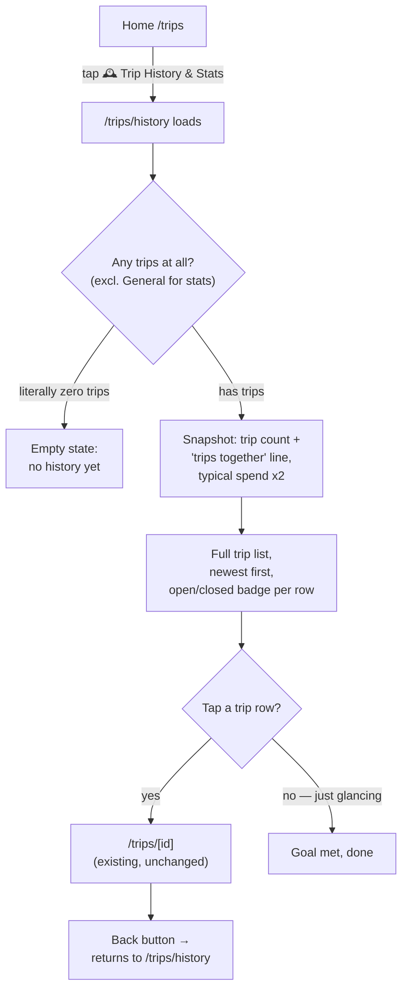

# Trips History & Analytics — UX Specification

## Personas

Per the BRD, there is no functional difference between the two users — same access, same
screens, same data. The personas differ only in disposition, which shapes tone and defaults
more than flow.

**Marcus**
- Goal: glance back at "everything we've done together" and get a quick pulse on spending,
  without digging through the operational trip list.
- Context of use: phone, PWA install (the app already declares `appleWebApp.capable`),
  short sessions — opens the app, checks something, closes it. Built the app, so has full
  technical comfort; not the audience the design needs to hand-hold.
- Frustration today: `/trips` is a to-do list (open trips to act on), not a place to reminisce
  or see a total. There's no single number that answers "how many trips have we actually been
  on" without counting rows by hand.

**Partner**
- Goal: identical to Marcus's — same two questions ("what have we done," "what's typical").
- Context of use: phone, occasional/reactive use (opens the app when a trip comes up, or when
  Marcus shows them something), lower technical comfort with the app's internals than Marcus,
  no reason to know or care about the data model.
- Frustration today: same as Marcus — nothing here is Partner-specific. Worth designing for
  the lower end of technical comfort by default (plain language over jargon like "median" —
  see Interaction Notes).

Both personas trigger this feature the same way: a reflective "let's see how much we've
travelled" moment, not a task they're blocked on. That distinguishes it from every other
screen in the app, which exists to let you *do* something (log an expense, settle up).

## Navigation & IA decision

This needs stating up front since it drives every flow below and directly answers the
question of how this integrates with the existing `/trips` IA rather than feeling bolted on.

- **Route: `/trips/history`** (nested under the existing Trips section, not a top-level
  route). The BRD resolved that this must be a literal separate page, but nesting it under
  `/trips` — with a "← Trips" back-link matching the existing `/trips/[id]` convention — keeps
  it conceptually part of the same section a user already knows, rather than introducing a new
  top-level destination the Header would need to advertise everywhere.
- **Entry point: one new link/card on `/trips` itself**, placed above the "Open" section
  (this is the "does anything on the existing trips page need a link added" answer — yes,
  exactly one thing). Something like a `🕰️ Trip History & Stats` pill, styled distinctly from
  the trip cards below it (e.g. lavender background, consistent with the balance banner on
  `/trips/[id]`) so it doesn't get scanned as "just another trip."
- **The global `Header` is not modified.** It renders on every page including the add-expense
  and settle forms; adding a persistent history nav item there would show up on focused task
  screens that have nothing to do with history, for a feature used in occasional reflective
  moments, not routine ones. A single entry point on the app's home screen (`/trips`, which
  root already redirects to) satisfies the BRD's "no more than 1–2 taps from home" success
  metric on its own (this makes it 1 tap), without touching a shared component used everywhere
  else.
- **`/trips/[id]`'s existing "← Trips" back-link is not changed** — it continues to point to
  `/trips`, exactly as it does today, whether a user arrived at the trip detail page from
  `/trips` or from `/trips/history`. Making that link context-aware would mean touching a
  shared, already-working detail page for a nav nicety, which risks the explicit non-goal of
  not regressing existing detail-page behavior. A user who came from History and wants to
  return there uses the browser/system back button — standard, expected mobile behavior, and
  zero risk to the existing page.

## User Flows

### Flow 1 — Browse trip history and get the snapshot (F1, F3, F4, F5)

Trigger: either persona opens the app in a reflective mood — "how many trips have we actually
done" / "what does a typical trip cost us" — rather than to do a task.

1. User opens the app → lands on `/trips` (home; root already redirects here).
2. User taps the `🕰️ Trip History & Stats` entry point above the Open section.
3. `/trips/history` loads. At the top: the Snapshot block (trip count + "trips together" line,
   typical spend per person). Below it: the full trip list, newest first, open and closed
   trips interleaved (not separated into sections the way `/trips` does — see rationale under
   Screen Inventory).
4. Branch A — user only wanted the pulse: reads the Snapshot numbers, done. Goal met without
   further action.
5. Branch B — user wants to revisit a specific trip: scans the list, taps a row.
6. App navigates to the existing `/trips/[id]` detail page (F2 — unmodified, reused as-is).
   User reviews expenses/settlements/balance exactly as they would from `/trips` today.
7. User is done; taps system/browser back to return to `/trips/history`, or the "← Trips"
   link to return to the operational list.

### Flow 2 — Discover history from a place a user already trusts (F1)

This is really Flow 1's first two steps, called out separately because it's the thing most
likely to be under-designed: a user who has never noticed this feature before.

1. User is on `/trips` for an ordinary reason (about to log an expense, or just checking
   balances).
2. They notice the `🕰️ Trip History & Stats` pill for the first time — it's visually
   distinct enough to register as "a different kind of thing" from the trip cards, but not so
   loud it competes with the actual task (open trips + create-trip form) that page exists for.
3. Curiosity click → Flow 1 continues from step 3.

No dedicated screen needed for this — it's a discoverability property of the entry point on
`/trips`, not a separate flow state.

## Screen / Component Inventory

| Screen / Component | Status | Purpose | Contains | Flow(s) |
|---|---|---|---|---|
| `/trips` | **Modified** (additive only) | Operational trip list — unchanged purpose | Existing Open/Closed sections + create-trip form, **plus** new `🕰️ Trip History & Stats` entry-point pill above the Open section | Flow 2 (entry point) |
| `/trips/history` | **New** | The retrospective "everything we've done" view + snapshot stats | Snapshot block (trip count/"together" line, two typical-spend figures); full trip list (all trips, newest first, status badge per row, no create-trip form since this is read-only); "← Trips" back-link | Flow 1 |
| `/trips/[id]` | **Unmodified, reused** | Per-trip detail — expenses, settlements, balance | Same as today — no changes | Flow 1 (step 6, via F2) |

Deliberately **not** in this inventory: add-expense, edit-expense, settle-up, close/reopen —
the BRD's non-goals explicitly rule out touching these, and no flow above requires a new
screen for them.

### Snapshot block — composition detail

The BRD separates F3 (trip count), F4 (typical spend), and F5 (travel-companion flavor line)
as three features, but for a two-fixed-user app, F5's "trips together" count is mathematically
identical to F3's trip count — every trip in this app is, by definition, both people's trip;
there's no per-trip participant concept to make them diverge (the BRD says as much). Rather
than show the same number twice framed two different ways, F3 and F5 are combined into one
line:

> 🧳 **You and Partner — 12 trips together**

F4 (typical spend) is presented as two labeled figures, one per person, using each person's
actual name/emoji (not "You"/"them" — see Interaction Notes for why):

> Typical spend per trip
> 🧑 Marcus — **$340**
> 🧑 Partner — **$210**

Both use the same basis (excludes the "General" trip, per the BRD's resolution) and both
should carry a small caption clarifying this is what each person *paid out*, not their share
of costs — see Interaction Notes on that specific wording risk.

## States (empty / loading / error / success)

### `/trips/history` — Snapshot block

| State | Condition | Design |
|---|---|---|
| **Empty** | Trip count excluding "General" is 0 (i.e. the only trip(s) that exist are General, or literally no trips exist yet) | Replace the whole Snapshot block with a single warm line: "✨ No trip history yet — once you've added a trip beyond General, we'll start tracking stats here." No numbers, no `$0.00` — a stat block showing zeroes on a brand-new install reads as broken, not as "not yet populated." |
| **Partial (valid, not empty)** | Trip count ≥ 1, but every qualifying trip has $0 in logged expenses so far (e.g. a trip was just created) | Show real numbers — `$0.00` is a legitimate median here, not an error — but consider softening the caption to "Nothing logged yet" instead of a bare `$0.00` if *both* people's medians are exactly zero, so it doesn't read as a bug. |
| **Loading** | First paint of `/trips/history` — this page aggregates across every trip's expenses, which is heavier than any existing page's query, so a perceptible delay is more likely here than elsewhere in the app | A lightweight skeleton (soft pastel pulsing blocks) for the Snapshot tiles specifically — this is the one page in the app where adding a route-level loading state is worth the extra file, since every other existing page is near-instant. |
| **Error** | Aggregation query fails | A friendly inline message ("Couldn't load your trip stats — try again") with a retry action, matching the app's tone — not a raw error/stack trace. Does **not** block the trip list below it from rendering if the list query itself succeeded; the two sections should fail independently where practical. |
| **Success** | Normal case | Snapshot block renders as designed above. |

### `/trips/history` — Trip list

| State | Condition | Design |
|---|---|---|
| **Empty** | Literally zero trips exist (including General) — an edge case that shouldn't occur post-setup but should still be designed for | Same empty message as the Snapshot block's empty state; don't show two different empty messages stacked on one page. |
| **Note: list vs. stats can disagree** | Only "General" exists | The list shows 1 row (General is a real trip a user has used — F1 doesn't exclude it, only F3/F4 do), while the Snapshot block above it shows the "no history yet" empty state. This mismatch is intentional per the BRD's own distinction between F1 (browsing, includes General) and F3/F4 (aggregates, excludes General) — call this out explicitly to engineering so it isn't "fixed" into consistency by accident. |
| **Loading** | Same reasoning as Snapshot block | Skeleton rows matching the existing `TripCard` shape. |
| **Error** | Trip/expense fetch fails | Same friendly retry message, scoped to the list section only. |
| **Success** | Normal case | Full list, newest first, each row showing name + status badge (see Interaction Notes) + balance text (reusing the existing `BalanceText` component, exactly as `/trips` does today) — tapping a row goes to `/trips/[id]`. |

### `/trips` — new entry-point pill

No new states needed beyond what the page already has — the pill is static content, not
data-driven, so it renders unconditionally regardless of trip data (even on the existing
"no trips yet" empty state of `/trips`, though tapping it in that scenario just lands on
`/trips/history`'s own empty state, which is a coherent, non-broken path).

## Interaction & Accessibility Notes

- **Status can no longer be conveyed by grouping alone.** `/trips` today distinguishes open
  vs. closed purely by which section a trip is in (plus a dimmed/opacity treatment for
  closed). `/trips/history` merges both into one chronological list, so that signal is lost —
  each row **must** carry an explicit text badge ("Open" / "Closed"), not rely on color or
  opacity alone, both for screen-reader users and for anyone who can't distinguish the subtle
  dimming at a glance. This is a real, easy-to-miss consequence of merging the two sections,
  not a generic a11y checklist item — flagging it because the existing page's pattern doesn't
  transfer cleanly.
- **Stat tiles should be announced as one sentence, not two fragments.** A common pattern
  (and gap) in stat-tile UIs is a big visual number with a small caption below it that are
  read separately by a screen reader in the DOM order they happen to appear. Give each tile a
  single `aria-label` that reads as a full sentence — e.g. "Twelve trips together with
  Partner" and "Marcus typically pays $340 per trip" — rather than relying on visual
  proximity between number and label to convey the relationship.
- **Use real names, not "You"/"them," for the two typical-spend figures.** This app has no
  real authentication — either person can tap the user-switcher pill in the Header at any
  time — so "You" is ambiguous about which physical person is meant if the device gets picked
  up by the other partner. The existing `BalanceText` component already sidesteps this by
  always using actual names; the Snapshot block should follow the same convention for
  consistency and to avoid a genuinely confusing mislabel.
- **Word "median" should not appear in user-facing copy.** It's the correct definition
  (BRD's resolution) but "typical spend" already communicates the intent in plain language;
  don't force Partner (lower technical comfort, per persona) to know what a median is. If a
  clarifying caption is wanted, phrase it behaviorally — "based on a normal trip, not skewed
  by one big one" — rather than naming the statistic.
- **Label the typical-spend figures as what each person *paid*, not what they "spent" or
  "owe."** The BRD is precise that F4 is each person's own paid-out share, not their split
  obligation — but "typical spend" read naively could be misread as "what a trip costs me"
  (i.e. their share of costs), which is a different, smaller number in a shared-expense app.
  Recommend explicit copy like "Marcus typically pays $340 per trip" (verb "pays," not
  "spends") to head this off — flagging as a copy call worth the extra scrutiny since it's
  exactly the kind of ambiguity that produces a "these numbers look wrong" complaint later.
- **No destructive actions on this page** — it's entirely read-only (explicit non-goal), so
  none of the confirmation-before-destructive-action patterns used elsewhere (close trip,
  reopen trip) apply here. Nothing on `/trips/history` should look tappable-and-consequential;
  every interactive element is a plain navigation link.
- **Keep the single-scroll pattern, not tabs.** Nothing else in this app uses a tabbed
  interface (`/trips/[id]` is one continuous scroll: balance → actions → expenses →
  payments). Snapshot-then-list as one scrollable page on `/trips/history` matches that
  existing pattern rather than introducing a new interaction shape the rest of the product
  doesn't use.
- **Whole-row tap target for trip list items**, exactly as `TripCard` already does today (a
  single wrapping `<Link>`, not nested interactive elements) — carry that forward unchanged
  rather than regressing to a less accessible pattern.

## Open items for engineering

None blocking — the BRD's six open questions are all resolved, and the nav/IA questions this
task specifically raised (route placement, whether `/trips` needs a link, whether the Header
needs one) are decided above with rationale. The one thing worth a second look during build:
whether "General" should still be excluded from F5's basis given F5 is now presented as the
same number as F3 (design assumption above is that it should, since F5 collapses into F3's
count) — flagging only because it's a one-line data assumption worth a quick confirm, not
because the design is blocked on it.
